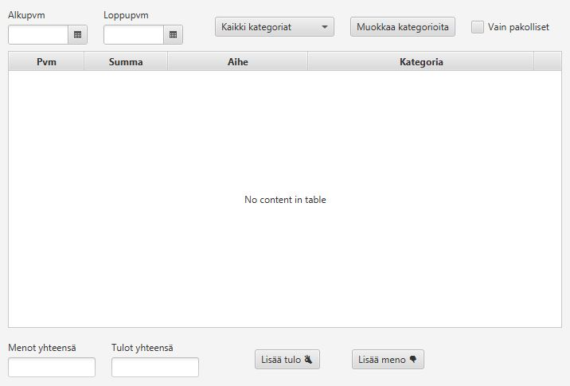
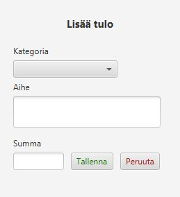
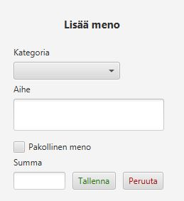

# Käyttöliittymä

Kun ohjelma avaan, käyttäjä näkee Main-ikkunan:

Keskellä näkyy tulot ja menot tableview-moduulissa.

Käyttäjä voi suodattaa tapahtumia eri tavoin. Tässä kohtaa suunnitelmissa olisi ainakin alku- ja loppupäivämäärän mukaan
tietylle aikavälille, eri kategorioiden mukaan, sekä 'vain pakollisten' menojen mukaan.

Ohjelma laskee tulot ja menot ja näyttää ne alhaalla menot yhteensä/tulot yhteensä -kentissä.

Ohjelmassa on myös muokkaa kategorioita-nappi, josta aukeaa kategorioiden muokkausikkuna. En ole vielä keksinyt miten se toteutetaan.

Alhaalla on napit "lisää tulo" ja "lisää meno", jotka molemmat avaavat ikkunan, jossa menoja/tuloja voidaan lisätä listaan.

Lisää tulo-ikkunassa valitaan tulon kategoria, lisätään aihe ja summa. Tämän jälkeen painetaan Tallenna, tai Peruuta. Peruuta sulkee ikkunan ja mitään ei tapahdu.

Lisää meno-ikkunassa valitaan kategoria, aihe, summa ja valinnaisesti voidaan lisätä "pakollinen meno" täppä, jos lisätään jokin kiinteä, toistuva meno.

  
  

