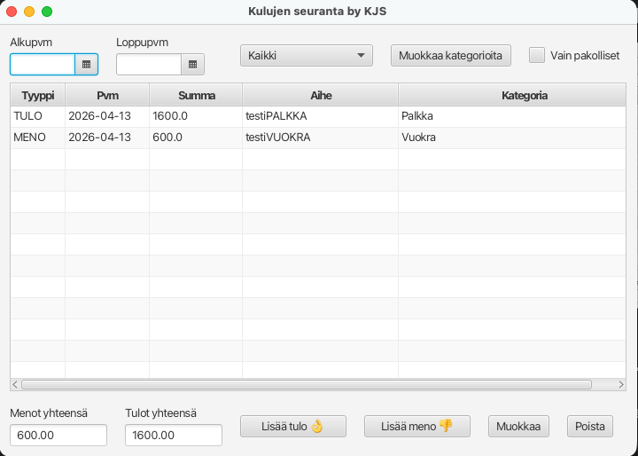
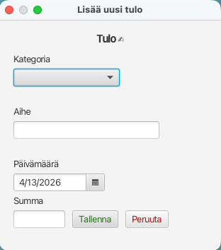
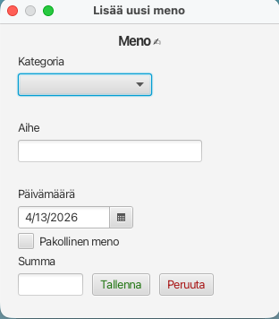
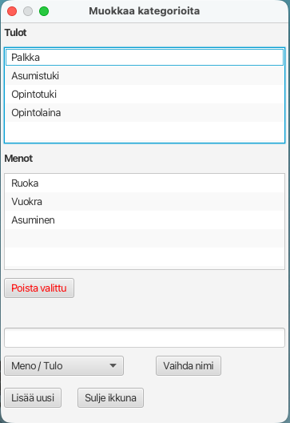

# kulujen seuranta by KJS -ohjelma

JavaFX-sovellus henkilökohtaisten tulojen ja menojen kirjaamiseen.

Sovelluksella käyttäjä voi:

- lisätä tuloja ja menoja
- määrittää ja muokata tulo- ja menokategorioita
- suodattaa tulo- ja menotapahtumia
- nähdä yhteenlasketut tulot ja menot

## Ohjelman käyttöohje:

Pääikkunan näkymässä on keskelle listattuna tulot ja menot. Alhaalla näkyvät tulojen ja menojen yhteenlasketut
kokonaissummat.

Uusia tulo- ja menotapahtumia voi lisätä Lisää tulo ja Lisää meno -painikkeista.

Painike avaa uuden ikkunan tulon tai menon lisäämiselle.

Tuloa lisätessä annetaan tulolle kategoria(valinnainen), aihe, päivämäärä ja summa. Summan tulee olla positiivinen
numero. Kaikki muut paitsi kategoria ovat pakollisia kenttiä.

Menoa lisätessä annetaan menolle kategoria(valinnainen), aihe, päivämäärä, summa, sekä valitaan onko meno pakollinen vai
ei. Pakollinen meno voi olla vaikkapa joka kuukausi toistuva maksu. Summan tulee olla positiivinen numero.

Meno- ja tulotapahtumia pääsee muokkaamaan valitsemalla listasta jonkin tapahtuman ja painamalla "Muokkaa"
-painikkeesta. Tämä avaa saman ikkunan, kuin lisäyksessä, mutta valmiiksi täytettynä tapahtuman tiedoilla, joita pääsee
muokkaamaan.

Meno- ja tulokategorioita voi lisätä, poistaa ja muokata "Muokkaa kategorioita" painikkeesta, joka avaa kategorioiden
muokkausikkunan. Kategorioiden muokkaus päivittää jo olemassa olevien tapahtumien kategorian vastaamaan muokkausta.

Meno- ja tulotapahtumia voi suodattaa pääikkunassa päivämäärävalitsimien, kategorioiden ja menojen pakollisuuden mukaan.
Tulojen ja menojen kokonaissumat päivittyvät alas suodatuksen mukaan.

## Pääikkunan toiminnallisuudet:

- Datepickerit suodatusta varten, Filtered listiin haetaan datepickerien tiedot, jotka vaikuttavat suodatukseen
- Kategoria-alasvetovalikon tiedot haetaan Filtered listiin. Listaan on kovakoodattu "Kaikki" ja "Ei kategoriaa", jotka
  suodattavat nimensä mukaisesti.
- Muokkaa kategoria-nappi avaa kategorioiden muokkausikkunan.
- Vain pakolliset checkboxin boolean-arvo haetaan Filtered listiin.
- Menot ja tulot -yhteensä kenttiin päivitetään Filterd listin suodatetut summat.
- Lisää tulo / meno avaavat tulojen/menojen lisäysikkunat.
- Muokkaa -nappi avaa tulojen/menojen lisäysikkunat, mutta niin, että niihin tulee tapahtuman tiedot, joita voi muokata
  ja tallentaa.
- Poista -nappi poistaa valitun tapahtuman ja kysyy käyttäjältä varmistuksen.

## Tulon lisäys / muokkaus

- Tulon lisäysikkuna toimii tulon lisäykseen ja muokkaukseen.
- Käynnistetään Main-ikkunasta joko lisää tulo tai muokkaa -napista. Nämä kutsuvat samaa metodia, jossa tarkistetaan
  onko Tapahtuma null vai ei.
- Valitaan kategoria kategorialistasta, joka näyttää vain Tulo-kategoriat tässä ikkunassa. Kategoria lista päivittyy
  kategorioiden muokkaksen yhteydessä.
- Aihe kenttään voi syöttää mitä vaan, paitsi tyhjiä välilyöntejä, tai tyhjää kenttää. Tämä käsitellään tallennuksessa.
- Päivämäärävalitsimesta valitaan päivämäärä, oletuksena nykyinen päivä.
- Summakenttään syötetään positiivinen numero, ei voi olla negatiivinen, tai muu merkki kuin numero. Käsitellään
  tallennuksessa. Ei voi jättää tyhjäksi.
- Käyttäjä saa varoituksen, jos kenttiä on tyhjänä, tai niissä on virheellisiä syötteitä. Nämä kaikki käsitellään kun
  käyttäjä painaa Tallenna-nappia.
- Tallenna-nappi käy läpi tarkistukset, tallentaa tapahtuman, tyhjää varoitukset ja sulkee ikkunan.
- Peruuta vain sulkee ikkunan eikä tallenna mitään. Eli seuraava lisäys alkaa tyhjällä lomakkeella.

## Menon lisäys / muokkaus

- Menon lisäysikkuna toimii menon lisäykseen ja muokkaukseen.
- Käynnistetään Main-ikkunasta joko "Lisää meno" tai "Muokkaa" -napista. Nämä kutsuvat samaa metodia, jossa tarkistetaan
  onko Tapahtuma null vai ei.
- Valitaan kategoria kategorialistasta, joka näyttää vain Meno-kategoriat tässä ikkunassa. Kategoria lista päivittyy
  kategorioiden muokkaksen yhteydessä.
- Aihe kenttään voi syöttää mitä vaan, paitsi tyhjiä välilyöntejä, tai tyhjää kenttää. Tämä käsitellään tallennuksessa.
- Päivämäärävalitsimesta valitaan päivämäärä, oletuksena nykyinen päivä.
- "Pakollinen meno" -checkboxi valitaan, jos meno on pakollinen, lisätään boolean-arvona tapahtumaan.
- Summakenttään syötetään positiivinen numero, ei voi olla negatiivinen, tai muu merkki kuin numero. Käsitellään
  tallennuksessa. Ei voi jättää tyhjäksi.
- Käyttäjä saa varoituksen, jos kenttiä on tyhjänä, tai niissä on virheellisiä syötteitä. Nämä kaikki käsitellään kun
  käyttäjä painaa Tallenna-nappia.
- Tallenna-nappi käy läpi tarkistukset, tallentaa tapahtuman, tyhjää varoitukset ja sulkee ikkunan.
- Peruuta vain sulkee ikkunan eikä tallenna mitään. Eli seuraava lisäys alkaa tyhjällä lomakkeella.

## Muokkaa katerorioita -ikkuna

- Kategorian muokkausikkuna listaa Tulo- ja Meno-kategoriat omina listoinaan.
- "Poista valittu" napista voi poista valitun kategorian, käyttäjältä varmistetaan poisto.
- Tekstikenttään ilmestyy valitun kategorian nimi ja sitä voi muokata "Vaihda nimi" -napilla voi tallentaa tämän
  muutoksen.
- Tekstikenttään voi myös kirjoittaa uuden kategorian nimen, valita sille meno- tai tulotyypin ja "Lisää uusi" -napista
  tallentaa sen uutena kategoriana.
- "Sulje ikkuna" -nappi sulkee ikkunan eikä tee mitään tallennuksia.
- Saman nimen ja tyypin omaavaa kategoriaa ei voi luoda ja ohjelma ilmoittaa siitä virhelabelilla.
- Kategorian tyyppiä ei pysty vaihtamaan muokkauksessa.

